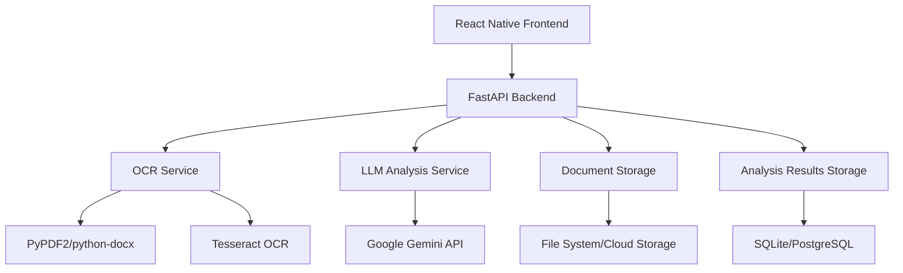

# Design Document

## Overview

The Legal Document Analysis System is designed as a full-stack application with a FastAPI backend for document processing and LLM analysis, and a React Native frontend for user interaction. The system processes legal documents through OCR, analyzes clauses using LLM technology, and provides visual highlighting with structured JSON metadata.

## Architecture

### System Architecture



### Component Architecture

The system follows a layered architecture pattern:

1. **Presentation Layer**: React Native mobile app
2. **API Layer**: FastAPI REST endpoints
3. **Business Logic Layer**: Document processing and analysis services
4. **Data Layer**: Document storage and analysis results persistence

## Components and Interfaces

### Backend Components

#### 1. Document Processing Service
- **Location**: `backend/services/document_processor.py`
- **Responsibilities**: 
  - Extract text from PDF, DOCX, and image files
  - Maintain document structure and line positioning
  - Handle OCR for scanned documents
- **Dependencies**: PyPDF2, python-docx, pytesseract

#### 2. LLM Analysis Service
- **Location**: `backend/services/llm_analyzer.py`
- **Responsibilities**:
  - Analyze clauses for severity levels (Low, Medium, High)
  - Evaluate predatory nature (Non-Predatory, Moderately Predatory, Highly Predatory)
  - Assess exposure levels (Low, Medium, High)
  - Generate explanations for classifications
- **Dependencies**: Google Gemini API

#### 3. Clause Extraction Service
- **Location**: `backend/services/clause_extractor.py`
- **Responsibilities**:
  - Identify individual clauses within legal documents
  - Maintain clause positioning and context
  - Handle different document structures

#### 4. Highlighting Service
- **Location**: `backend/services/highlighter.py`
- **Responsibilities**:
  - Generate highlighting metadata for frontend
  - Combine severity, predatory, and exposure classifications
  - Create visual indicators for risk levels

### API Endpoints

#### Document Analysis Endpoints
- `POST /api/documents/analyze` - Upload and analyze documents
- `GET /api/documents/{document_id}/results` - Retrieve analysis results
- `GET /api/documents/{document_id}/highlights` - Get highlighting data
- `GET /api/documents/` - List analyzed documents

#### Health and Status Endpoints
- `GET /api/health` - System health check
- `GET /api/analysis/status/{job_id}` - Analysis job status

### Frontend Components

#### 1. Document Upload Component
- **Location**: `frontend/components/DocumentUpload.tsx`
- **Responsibilities**: Handle file selection and upload

#### 2. Document Viewer Component
- **Location**: `frontend/components/DocumentViewer.tsx`
- **Responsibilities**: Display documents with highlighting

#### 3. Analysis Results Component
- **Location**: `frontend/components/AnalysisResults.tsx`
- **Responsibilities**: Show detailed analysis metadata

#### 4. Risk Dashboard Component
- **Location**: `frontend/components/RiskDashboard.tsx`
- **Responsibilities**: Display risk summaries and comparisons

## Data Models

### Core Data Models

#### Document Model
```python
class Document(BaseModel):
    id: str
    name: str
    content_type: str
    upload_timestamp: datetime
    file_path: str
    text_content: str
    analysis_status: AnalysisStatus
```

#### Clause Analysis Model
```python
class ClauseAnalysis(BaseModel):
    id: str
    document_id: str
    line: str  # The highlighted clause text
    severity: SeverityLevel  # Low, Medium, High
    explanation: str  # Detailed reasoning for severity
    predatory_level: PredatoryLevel
    exposure_level: ExposureLevel
    start_position: int
    end_position: int
    confidence_score: float
```

#### Analysis Result Model
```python
class AnalysisResult(BaseModel):
    document_id: str
    document_name: str
    clauses: List[ClauseAnalysis]
    overall_risk_score: float
    analysis_timestamp: datetime
    processing_time: float
```

### Enumerations

```python
class SeverityLevel(str, Enum):
    LOW = "Low"
    MEDIUM = "Medium"
    HIGH = "High"

class PredatoryLevel(str, Enum):
    NON_PREDATORY = "Non-Predatory"
    MODERATELY_PREDATORY = "Moderately Predatory"
    HIGHLY_PREDATORY = "Highly Predatory"

class ExposureLevel(str, Enum):
    LOW_EXPOSURE = "Low Exposure"
    MEDIUM_EXPOSURE = "Medium Exposure"
    HIGH_EXPOSURE = "High Exposure"

class AnalysisStatus(str, Enum):
    PENDING = "pending"
    PROCESSING = "processing"
    COMPLETED = "completed"
    FAILED = "failed"
```

## Error Handling

### Error Categories

1. **Document Processing Errors**
   - Unsupported file formats
   - Corrupted files
   - OCR failures
   - Text extraction errors

2. **LLM Analysis Errors**
   - API rate limits
   - Network timeouts
   - Invalid responses
   - Service unavailability

3. **Data Validation Errors**
   - Invalid input parameters
   - Missing required fields
   - Schema validation failures

### Error Response Format

```python
class ErrorResponse(BaseModel):
    error_code: str
    message: str
    details: Optional[Dict[str, Any]]
    timestamp: datetime
```

### Error Handling Strategy

- Implement retry mechanisms for transient failures
- Provide fallback analysis methods when LLM services are unavailable
- Log all errors with appropriate context for debugging
- Return user-friendly error messages while maintaining security

## Testing Strategy

### Unit Testing

1. **Document Processing Tests**
   - Test text extraction from various file formats
   - Validate OCR accuracy with sample documents
   - Test error handling for corrupted files

2. **LLM Analysis Tests**
   - Mock LLM responses for consistent testing
   - Test classification logic with known inputs
   - Validate JSON output format

3. **API Endpoint Tests**
   - Test all REST endpoints with various inputs
   - Validate request/response schemas
   - Test error scenarios and edge cases

### Integration Testing

1. **End-to-End Document Processing**
   - Upload document → Extract text → Analyze → Return results
   - Test with real legal documents
   - Validate complete workflow

2. **Frontend-Backend Integration**
   - Test file upload functionality
   - Validate data flow between components
   - Test real-time status updates

### Performance Testing

1. **Load Testing**
   - Test concurrent document uploads
   - Measure analysis processing times
   - Test system behavior under high load

2. **Scalability Testing**
   - Test with large documents
   - Measure memory usage during processing
   - Test database performance with multiple documents

## Security Considerations

### Data Protection
- Encrypt uploaded documents at rest
- Implement secure file upload validation
- Sanitize all user inputs
- Use HTTPS for all communications

### Access Control
- Implement user authentication and authorization
- Secure API endpoints with proper authentication
- Rate limiting for API calls
- Input validation and sanitization

### Privacy
- Implement data retention policies
- Provide options for document deletion
- Ensure compliance with data protection regulations
- Anonymize sensitive information in logs

## Performance Optimization

### Backend Optimizations
- Implement asynchronous document processing
- Use connection pooling for database operations
- Cache frequently accessed analysis results
- Optimize LLM API calls with batching

### Frontend Optimizations
- Implement lazy loading for large documents
- Use virtual scrolling for long document lists
- Optimize image rendering and caching
- Implement progressive loading for analysis results

## Deployment Architecture

### Development Environment
- Local FastAPI server with hot reload
- React Native development server
- Local database (SQLite)
- Mock LLM services for testing

### Production Environment
- Containerized FastAPI application
- React Native mobile app distribution
- Cloud database (PostgreSQL)
- Production LLM API integration
- CDN for static assets
- Load balancer for API scaling