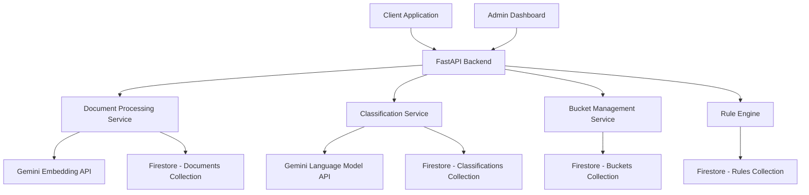

# Design Document

## Overview

The Legal Document Severity Classification System is a sophisticated AI-powered solution that uses a bucketed context mechanism to classify legal documents by severity level. The system leverages Google's Gemini model for embeddings and classification, Firestore for scalable document storage, and provides fully automated classification with comprehensive audit logging.

The core innovation is the bucketed context approach: reference documents are clustered into semantic buckets (e.g., employment law, taxation, rent control), and at inference time, the system selects the most relevant bucket to provide focused context for classification.

## Architecture

### High-Level Architecture



### System Components

1. **Document Processing Service**: Handles document ingestion, text extraction, and embedding generation
2. **Bucket Management Service**: Creates and maintains semantic buckets using clustering algorithms
3. **Classification Service**: Performs document classification using bucket-based context retrieval
4. **Rule Engine**: Applies deterministic rules and overrides to classifications
5. **Audit Service**: Manages comprehensive logging and audit trails
6. **Monitoring Service**: Tracks performance metrics and system health

## Components and Interfaces

### 1. Document Processing Service

**Purpose**: Process incoming documents and reference documents for storage and classification.

**Key Classes**:
- `DocumentProcessor`: Main orchestrator for document processing
- `TextExtractor`: Extracts text from various document formats (PDF, DOCX)
- `EmbeddingGenerator`: Generates embeddings using Gemini API
- `DocumentStore`: Manages Firestore operations for documents

**Interfaces**:
```python
class DocumentProcessor:
    async def process_reference_document(self, file: UploadFile, metadata: dict) -> str
    async def process_classification_document(self, file: UploadFile) -> ProcessedDocument
    
class EmbeddingGenerator:
    async def generate_embedding(self, text: str) -> List[float]
    async def batch_generate_embeddings(self, texts: List[str]) -> List[List[float]]
```

### 2. Bucket Management Service

**Purpose**: Create, maintain, and query semantic buckets for efficient context retrieval.

**Key Classes**:
- `BucketManager`: Orchestrates bucket operations
- `ClusteringEngine`: Performs document clustering using embeddings
- `CentroidCalculator`: Computes and updates bucket centroids
- `BucketStore`: Manages Firestore operations for buckets

**Interfaces**:
```python
class BucketManager:
    async def create_buckets(self, documents: List[Document]) -> List[Bucket]
    async def find_relevant_buckets(self, query_embedding: List[float], top_k: int = 3) -> List[Bucket]
    async def update_bucket_centroids(self, bucket_ids: List[str]) -> None
    
class ClusteringEngine:
    def cluster_documents(self, embeddings: List[List[float]], n_clusters: int) -> List[int]
```

### 3. Classification Service

**Purpose**: Classify documents using bucket-based context and Gemini model.

**Key Classes**:
- `ClassificationEngine`: Main classification orchestrator
- `ContextRetriever`: Retrieves relevant context from buckets
- `GeminiClassifier`: Interfaces with Gemini API for classification
- `ConfidenceCalculator`: Computes final confidence scores

**Interfaces**:
```python
class ClassificationEngine:
    async def classify_document(self, document: ProcessedDocument) -> ClassificationResult
    
class ContextRetriever:
    async def retrieve_context(self, query_embedding: List[float], bucket_ids: List[str], top_n: int = 5) -> ContextBlock
    
class GeminiClassifier:
    async def classify_with_context(self, document_text: str, context: ContextBlock, rules: List[Rule]) -> RawClassification
```

### 4. Rule Engine

**Purpose**: Apply deterministic rules and overrides to classifications.

**Key Classes**:
- `RuleEngine`: Evaluates rules against documents
- `RuleEvaluator`: Checks individual rule conditions
- `OverrideManager`: Applies rule-based overrides

**Interfaces**:
```python
class RuleEngine:
    async def evaluate_rules(self, document_text: str, classification: RawClassification) -> RuleEvaluation
    async def apply_overrides(self, classification: RawClassification, rule_evaluation: RuleEvaluation) -> ClassificationResult
```

## Data Models

### Core Data Structures

```python
@dataclass
class Document:
    id: str
    text: str
    embedding: List[float]
    metadata: Dict[str, Any]
    created_at: datetime
    document_type: str  # "reference" or "classification"
    severity_label: Optional[str]  # For reference documents

@dataclass
class Bucket:
    bucket_id: str
    bucket_name: str
    centroid_embedding: List[float]
    document_ids: List[str]
    created_at: datetime
    updated_at: datetime
    document_count: int

@dataclass
class Rule:
    rule_id: str
    name: str
    condition: str  # JSON-serialized condition logic
    severity_override: str
    priority: int
    active: bool

@dataclass
class ClassificationResult:
    label: str  # LOW, MEDIUM, HIGH, CRITICAL
    confidence: float
    rationale: str
    evidence_ids: List[str]
    bucket_id: str
    rule_overrides: List[str]
    confidence_warning: bool  # True if confidence is below typical thresholds

@dataclass
class ContextBlock:
    bucket_info: Dict[str, Any]
    retrieved_chunks: List[Dict[str, Any]]
    applicable_rules: List[Rule]
```

### Firestore Collections Schema

**Documents Collection** (`legal_documents`):
```json
{
  "id": "doc_uuid",
  "text": "document content",
  "embedding": [0.1, 0.2, ...],
  "metadata": {
    "filename": "contract.pdf",
    "upload_date": "2024-01-15T10:30:00Z",
    "document_type": "reference",
    "severity_label": "HIGH"
  },
  "created_at": "2024-01-15T10:30:00Z"
}
```

**Buckets Collection** (`semantic_buckets`):
```json
{
  "bucket_id": "bucket_uuid",
  "bucket_name": "employment_law",
  "centroid_embedding": [0.15, 0.25, ...],
  "document_ids": ["doc1", "doc2", "doc3"],
  "created_at": "2024-01-15T10:30:00Z",
  "updated_at": "2024-01-15T10:30:00Z",
  "document_count": 3
}
```

**Classifications Collection** (`document_classifications`):
```json
{
  "classification_id": "class_uuid",
  "document_id": "doc_uuid",
  "result": {
    "label": "HIGH",
    "confidence": 0.87,
    "rationale": "Based on employment law precedent",
    "evidence_ids": ["doc-55", "rule-03"],
    "bucket_id": "bucket-12",
    "confidence_warning": false
  },
  "created_at": "2024-01-15T10:30:00Z"
}
```

## Error Handling

### Error Categories and Strategies

1. **Gemini API Errors**:
   - Rate limiting: Implement exponential backoff with jitter
   - API failures: Retry with circuit breaker pattern
   - Invalid responses: Fallback to rule-based classification

2. **Firestore Errors**:
   - Connection failures: Retry with exponential backoff
   - Transaction conflicts: Implement optimistic concurrency control
   - Data consistency: Use Firestore transactions for critical operations

3. **Document Processing Errors**:
   - Unsupported formats: Return clear error messages
   - Corrupted files: Implement file validation
   - Large files: Implement streaming and chunking

4. **Classification Errors**:
   - Low confidence: Flag with confidence warning but still provide classification
   - Missing context: Use fallback classification strategies
   - Rule conflicts: Apply priority-based resolution

### Error Response Format

```python
@dataclass
class ErrorResponse:
    error_code: str
    message: str
    details: Optional[Dict[str, Any]]
    retry_after: Optional[int]  # For rate limiting
```

## Testing Strategy

### Unit Testing

1. **Document Processing Tests**:
   - Text extraction from various formats
   - Embedding generation and validation
   - Firestore CRUD operations

2. **Bucket Management Tests**:
   - Clustering algorithm accuracy
   - Centroid calculation correctness
   - Bucket selection logic

3. **Classification Tests**:
   - Context retrieval accuracy
   - Gemini API integration
   - Rule engine evaluation

4. **Rule Engine Tests**:
   - Rule condition parsing
   - Override application logic
   - Priority resolution

### Integration Testing

1. **End-to-End Classification Flow**:
   - Document upload to final classification
   - Human review workflow
   - Performance under load

2. **Firestore Integration**:
   - Data consistency across collections
   - Transaction handling
   - Concurrent access scenarios

3. **Gemini API Integration**:
   - Rate limiting behavior
   - Error handling and retries
   - Response parsing and validation

### Performance Testing

1. **Scalability Tests**:
   - Classification throughput with increasing document volume
   - Bucket selection performance with large numbers of buckets
   - Firestore query performance optimization

2. **Accuracy Tests**:
   - Classification accuracy across different document types
   - Bucket selection relevance
   - Rule override effectiveness

### Test Data Strategy

1. **Synthetic Data Generation**:
   - Generate legal documents with known severity levels
   - Create diverse document types and formats
   - Simulate edge cases and error conditions

2. **Evaluation Datasets**:
   - Curated legal document datasets with expert annotations
   - Cross-validation sets for model evaluation
   - Benchmark datasets for performance comparison

## Performance Considerations

### Optimization Strategies

1. **Embedding Caching**:
   - Cache document embeddings in Firestore
   - Implement embedding versioning for model updates
   - Use Redis for frequently accessed embeddings

2. **Bucket Selection Optimization**:
   - Pre-compute bucket similarities for common queries
   - Implement approximate nearest neighbor search
   - Use hierarchical clustering for faster bucket selection

3. **Firestore Query Optimization**:
   - Create composite indexes for common query patterns
   - Implement pagination for large result sets
   - Use Firestore's built-in caching mechanisms

4. **Gemini API Optimization**:
   - Batch API calls where possible
   - Implement request pooling and connection reuse
   - Use streaming for large document processing

### Monitoring and Alerting

1. **Performance Metrics**:
   - Classification latency (p50, p95, p99)
   - Throughput (documents per second)
   - Error rates by component

2. **Business Metrics**:
   - Classification accuracy by severity level
   - Human review queue length
   - Rule override frequency

3. **System Health**:
   - Gemini API response times and error rates
   - Firestore query performance
   - Memory and CPU utilization

## Security Considerations

### Data Protection

1. **Document Security**:
   - Encrypt sensitive documents at rest in Firestore
   - Implement access controls based on user roles
   - Audit all document access and modifications

2. **API Security**:
   - Implement JWT-based authentication
   - Rate limiting per user/organization
   - Input validation and sanitization

3. **Gemini API Security**:
   - Secure API key management using environment variables
   - Implement request signing for additional security
   - Monitor for unusual API usage patterns

### Privacy Compliance

1. **Data Minimization**:
   - Store only necessary document metadata
   - Implement data retention policies
   - Provide data deletion capabilities

2. **Audit Logging**:
   - Log all classification decisions and human reviews
   - Track data access patterns
   - Maintain immutable audit trails

## Deployment Architecture

### Infrastructure Components

1. **Application Layer**:
   - FastAPI application deployed on Google Cloud Run
   - Auto-scaling based on request volume
   - Load balancing across multiple instances

2. **Data Layer**:
   - Firestore for document and metadata storage
   - Cloud Storage for large document files
   - Redis for caching frequently accessed data

3. **AI/ML Layer**:
   - Gemini API for embeddings and classification
   - Custom model endpoints for specialized tasks
   - Model versioning and A/B testing infrastructure

4. **Monitoring Layer**:
   - Cloud Monitoring for system metrics
   - Cloud Logging for application logs
   - Custom dashboards for business metrics

### Deployment Pipeline

1. **CI/CD Pipeline**:
   - Automated testing on pull requests
   - Staging deployment for integration testing
   - Blue-green deployment for production releases

2. **Configuration Management**:
   - Environment-specific configuration files
   - Secret management using Google Secret Manager
   - Feature flags for gradual rollouts

This design provides a robust, scalable foundation for the legal document severity classification system, incorporating best practices for AI/ML systems, cloud-native architecture, and enterprise-grade security and monitoring.