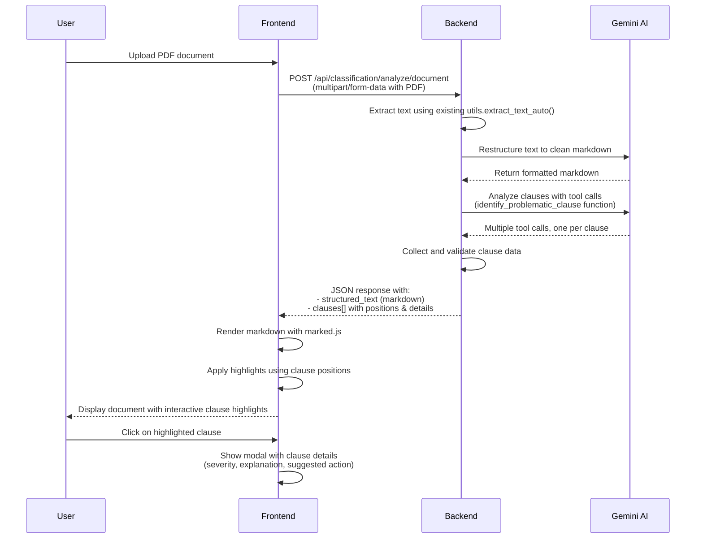

# backend for the genai google repo

instructions to operate the backend:

```py
1. uv sync
2. uv venv (check if there is already an env)
3. uv run uvicorn main:app --reload
```

# contribution

before contributing please make sure to execute `source .venv/bin/activate` so that your LSP picks up on function and type hints for fastapi etc.
and pls document whatever responses you will be returning :))
## Document Analysis

The backend provides AI-powered legal document analysis for identifying predatory clauses:

### Document Analysis Endpoint
- `POST /api/classification/analyze/document`

**Features:**
- Two-phase AI pipeline: text restructuring + clause analysis
- Gemini AI with tool calling for precise clause identification
- Position-based highlighting support for frontend integration
- Comprehensive clause categorization and severity assessment

**Request:** `multipart/form-data` with `file` as a PDF document

**Response:** JSON with structured text and identified problematic clauses
```json
{
  "structured_text": "# Clean markdown formatted document...",
  "clauses": [
    {
      "clause_text": "Exact clause text from document",
      "start_position": 123,
      "end_position": 456,
      "severity": "HIGH",
      "category": "unfair_fees",
      "explanation": "Detailed explanation of why this clause is problematic",
      "suggested_action": "Recommended action for the user"
    }
  ]
}
```

**Example Usage:**
```bash
curl -X POST 'http://localhost:8000/api/classification/analyze/document' \
     -F 'file=@contract.pdf'
```

## OCR Extraction

This backend can extract text from:
- PDFs with embedded text
- Scanned PDFs (via OCR)
- Images (`image/png`, `image/jpeg`, `image/webp`, `image/tiff`, `image/bmp`)
- DOCX documents

Endpoints:
- `POST /api/ocr/extract` (preferred)

Request: `multipart/form-data` with `files` as one or multiple `UploadFile`s.

Response model: `HighlighterOutput` where `documentId` contains the raw extracted text for each uploaded file, aligned to `documentName` order.

Example:

```zsh
curl -s -X POST \
	-F "files=@/path/to/file1.pdf" \
	-F "files=@/path/to/image.jpg" \
	http://127.0.0.1:8000/api/ocr/extract | jq .
```

Supported content types:
- `application/pdf`
- `application/vnd.openxmlformats-officedocument.wordprocessingml.document`
- Common images: `image/png`, `image/jpeg`, `image/jpg`, `image/webp`, `image/tiff`, `image/bmp`
- Note: legacy `application/msword` (.doc) is not supported — please convert to `.docx`.

Python packages (auto-installed via `uv sync`): `pypdf2`, `python-docx`, `pytesseract`, `pillow`, `pdf2image`.

Linux system packages required for OCR and PDF rasterization:

```zsh
sudo apt update
sudo apt install -y tesseract-ocr poppler-utils
```

Troubleshooting:
- If OCR for scanned PDFs returns empty text, ensure `tesseract-ocr` is installed and on PATH.
- If PDF-to-image conversion fails, ensure `poppler-utils` (provides `pdftoppm`) is installed.
- You can tune OCR quality by adjusting DPI in `extract_text_from_pdf_bytes` (default 300).

## API routes

Base URL examples assume local dev: `http://127.0.0.1:8000`.

- GET `/` — simple health/welcome.

OCR routes (prefix `-/api/ocr-`):
- GET `/api/ocr/health` — OCR router health.
- GET `/api/ocr/categorise` — placeholder for future tagging logic.
- POST `/api/ocr/extract` — extract text from PDFs (text or scanned), DOCX, or images; returns `HighlighterOutput` with text in `documentId`.
- POST `/api/ocr/categorise` — legacy alias to `/api/ocr/extract` (hidden in schema).

User routes (prefix `-/api/user-`):
- GET `/api/user/health` — user router health.
- POST `/api/user/add` — create a user (stores in Firestore).
- DELETE `/api/user/delete/{id}` — delete a user by ID.
- PUT `/api/user/update/{id}` — update user fields; if `wants_history` becomes false, `history` is cleared.

## Document Analysis Flow

